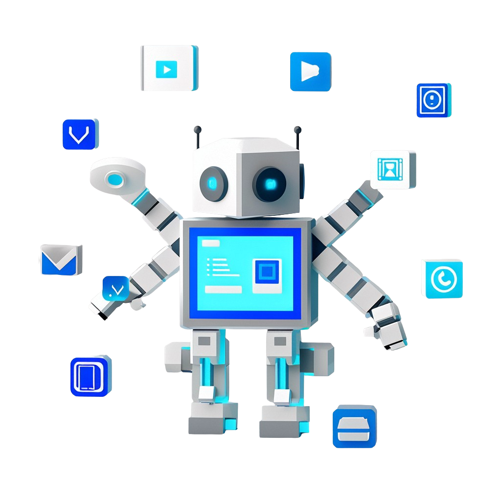
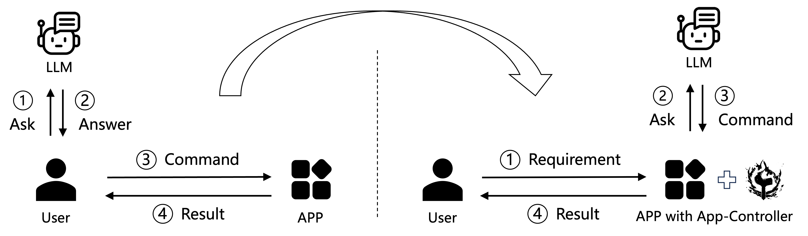
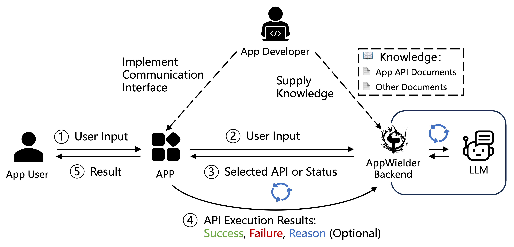

English | [中文](./README_ZH.md)

<h3 align="center"> App-Controller: Allow users to manipulate your App with natural
language</h3>

[//]: # ([![]&#40;https://img.shields.io/github/stars/gencay/vscode-chatgpt?color=blue&label=Github%20Stars&#41;]&#40;&#41;)

## 新闻

- **[2024-06-27]**
  Based on **App-Controller**, we have developed a Visual Studio Code plugin, [SmartVscode](https://github.com/alibaba/smart-vscode-extension), which allows users to manipulate
  various VS Code features through natural language commands, such as changing the theme or generating code with a single
  sentence. 
- **[2024-06-27]**
  We are thrilled to announce the release of **App-Controller** version 1.0!

---

## What is App-Controller?

App-Controller is an innovative API orchestration framework built upon Large Language Models (LLMs) and Agents.
It aims to integrate and synchronize APIs provided by any applications (APPs) using the advanced reasoning capabilities of LLMs.

- App-Controller allows applications to respond and execute instructions formulated in natural language, significantly simplifying
  user interaction with applications.

> The above image illustrates how App-Controller enhances application interactivity.
> Specifically, the graphic is divided into two parts: the left-half details the traditional process of inquiry and execution when
> completing tasks, while the right-half displays the streamlined workflow with App-Controller's intervention.
> In a traditional scenario, when a user needs to accomplish a task in an App but doesn’t know how to do it, they first ask the
> LLM and receive an answer, then command the App to obtain the result and complete the task.
> In contrast, after introducing App-Controller, the user simply inputs their requirement in natural language directly into the App to
> get the result and finish the task. With App-Controller's assistance, the App consults the LLM for user intent and learns the
> necessary commands to execute, subsequently returning the result.

- Any application vendor only needs to implement communication interfaces on the App and submit a list of supported APIs to
  App-Controller, which can independently explore and identify the optimal API call sequence to fulfill user instructions.

App-Controller 's core competency lies in its highly automated API orchestration logic and user-friendly data interaction patterns,
making it easier and faster for developers to add intelligent features to their apps.
It also comes with a flexible HTTP interface that enhances the way applications work together.
In the end, App-Controller aims to provide a straightforward and efficient way for users and developers to interact with apps,
enabling a seamless experience that meets diverse needs.

🔥 **Enhanced Usability**: Allows users to control your application via simple natural language commands, eliminating the need to learn complex interfaces or command sets and making the services or content readily accessible.

🛠️ **Easy Integration**: Developers only need to register their application's API directory, and App-Controller will automatically manage the identification and orchestration, negating the need for intricate coding.

🚀 **Asynchronous and Concurrent Processing**: App-Controller enhances its support for concurrent requests using modern asynchronous technology, ensuring efficiency and quick responses even under high-load conditions with multiple users or tasks.

🌐 **Robust API Interactions**: App-Controller offers a stable and user-friendly HTTP API interface, enabling seamless interactions with applications while ensuring high-efficiency and security in data transfer.

🤖 **Multitude of Large Language Models**: App-Controller integrates well with various Large Language Models, allowing developers to choose the most suitable model based on their needs and contexts for optimal understanding and natural language processing.

📚 **Comprehensive Documentation**: App-Controller provides extensive documentation, including quick start guides, API references, best practice examples, and FAQs, to help developers get started and fully utilize the framework.

💾 **Persistent Task Flows**: Task workflows can be stored persistently in databases, facilitating the monitoring and management of tasks and allowing developers to check the status and history at any time.

🛢️ **Smart Caching Mechanism**: With advanced caching technology, App-Controller optimizes performance and response times by intelligently storing frequently requested results, reducing the number of calls to external models (coming soon).

🌟 **Token Optimization**: App-Controller's optimization algorithm intelligently assesses message utility, reducing token usage and cutting down on costs associated with API calls (coming soon).

## Applications: The SmartVscode Plugin Based on App-Controller

We developed a Visual Studio Code plugin, [SmartVscode](https://github.com/alibaba/smart-vscode-extension), that allows users to operate various VS Code features through natural language. Below are some demonstrations of its features:

### Tic-tac-toe Game
https://github.com/user-attachments/assets/82d84f26-de49-4eae-9e31-e838c398343a

### A comprehensive pipeline in Python including configuration, code, and execution.
https://github.com/user-attachments/assets/9ab9f14c-ff94-4dc5-af67-a358bd03e0f6

### Style Changing
https://github.com/user-attachments/assets/d29155d5-58c2-488b-8477-f95cd285533a

### Theme Changing
https://github.com/user-attachments/assets/94636935-3789-496f-a6be-1baa0d18f63c

## Connect to your Application

The following image illustrates the process of introducing intelligence into applications using the App-Controller framework,
detailing the tasks that application developers need to undertake and the process by which App-Controller independently orchestrates
API calls to fulfill user instructions.

#### Preparation Stage:

1. **Communication interface**: Application developers need to achieve a **standard communication interface** with the App-Controller.
2. **Document**: They also need to provide soe **knowledge** to the App-Controller, including the App's available API documentation
   and other optional documents.

#### Deploy stage

After starting App-Controller, the App forwards user input to the App-Controller. The App-Controller integrates user input and available API
information, interacts with the LLM to select the appropriate API to execute, and determine the task status. Iteratively, the App
executes the selected API and returns the execution result to the App-Controller. The App-Controller continues to interact with the LLM to
make the next decision. The pipeline is terminated when the task has been completed, or failed, and the result is returned to the
user.

After completing these steps, the App can achieve intelligent interaction with users.

## Documentation

[Documentation](https://alibaba.github.io/app-controller/en/index.html)
provides comprehensive information on how to integrate App-Controller into your application. You can refer to these documents for an improved experience with App-Controller.

## License
App-Controller is released under the Apache License 2.0.

## Contributions
Join us in building App-Controller!
Please see our [Contribution Guide](https://alibaba.github.io/app-controller/en/tutorial/contribute.html) for more detail
