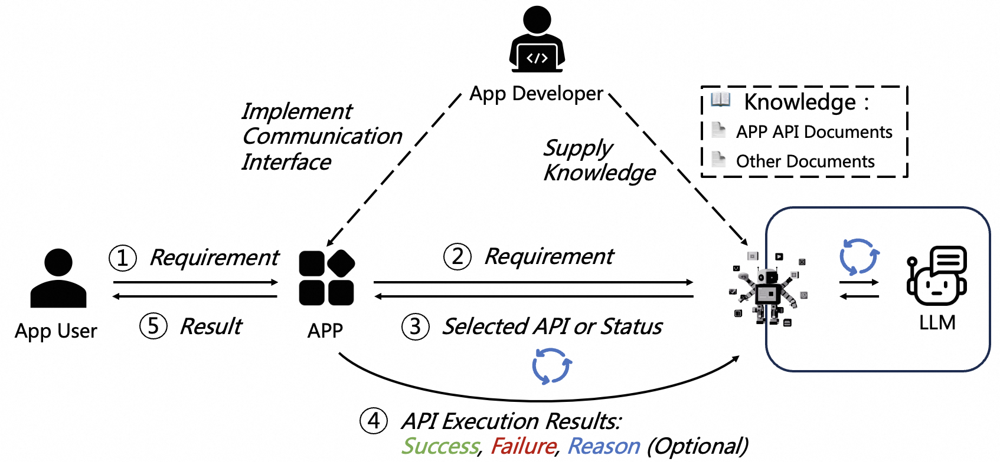

[English](./README.md) | 中文

<h3 align="center"> App-Controller: 允许用户通过自然语言来操纵你的应用程序</h3>

## 新闻

- **[2024-11-08]**
  基于**App-Controller**，我们实现了一个Visual Studio
  Code插件[SmartVscode](https://github.com/alibaba/smart-vscode-extension)
  ，允许用户通过自然语言来操作VS Code支持的各种功能，例如：一句话改变主题，字体，生成代码等等。
- **[2024-11-08]**
  我们现在发布了**App-Controller** v1.0版本！

---

## 什么是App-Controller？

App-Controller 是一个基于大型语言模型（LLM）和代理（Agent）的创新性的 API 编排框架。该框架旨在通过运用 LLM 的高级推理功能，实现对不同应用程序（APP）提供的 API 接口的整合与协调。
- App-Controller允许应用程序响应和执行基于自然语言的指令，极大提升了用户体验，并简化了应用程序与用户的交互流程。

  
  
  > 上图展示了 App-Controller 如何增强应用程序的交互能力。具体而言，图片分为两部分，左半部分描述了传统完成任务时的问答和执行流程，右半部分展示了引入App-Controller后的完成任务的流程。传统流程中，当用户（User）需要在 App 中完成某项任务却不知道该如何操作时，他首先询问（Ask）LLM并且得到回答（Answer），于是用户对 App 发送命令（Command）并且获得其执行结果（Result），即完成了任务。引入 App-Controller 后的流程中，用户仅需使用自然语言向App输入需求（Requirement），便可得到执行结果（Result）完成任务。App 在 App-Controller 的协助下询问 LLM 用户意图并得知需要执行的命令，执行命令后返回结果。

- 任何应用程序厂商仅需在 App 上实现通信接口并且向 App-Controller 提交其支持的 API 清单，框架便能独立地探索并识别出完成用户指令所需的最佳 API 调用顺序。

App-Controller 的核心竞争力在于其高度自动化的 API 编排逻辑以及易用的数据交互模式，这些都大幅降低了应用开发商在引入智能化过程中遇到的复杂性和开发周期，加快了应用程序功能的扩展与精进。
此外，它还搭载了一个高度抽象化、极具弹性的 HTTP 交互接口，进一步促进了应用程序的互联互通。
最终，App-Controller 的愿景是为用户和开发者带来一种更加自然、直觉化且效率高的操作模式，赋予应用程序以无与伦比的适应力，以满足用户各种多样化的需求。

- 🔥 增强易用性：允许用户可通过简单的自然语言命令来直接控制你的应用程序，无需学习复杂的界面或命令集，即可使用提供的服务或内容。

- 🛠️ 轻松集成：开发者只需注册其应用程序的 API 清单，App-Controller 会自动负责后续的识别和编排工作，无需复杂编码工作。

- 🚀 异步与并发处理：通过采用现代异步技术，App-Controller 强化了其对并发请求的支持，确保即使在多用户或多任务的高负载环境下，应用程序也能保持高效和响应迅速。

- 🌐 强大的 API 交互接口：App-Controller 设计了一套用户友好、稳固的 HTTP API 接口，这意味着与应用程序的交互可以无缝自由，同时确保数据传输的高效率和安全性。

- 🤖 支持多种大型语言模型：App-Controller 能够很好地与多种大型语言模型进行集成，这意味着开发者可以根据需求和场景选择最适合的模型，以实现最优的自然语言理解和处理能力。

- 📚 丰富的文档资源：App-Controller 提供了详尽的文档，其中包括快速入门指南、API参考手册、最佳实践案例和常见问题解答，帮助开发者轻松上手并充分利用框架的所有功能。

- 💾 任务流的持久化：任务流程可以持久存储在数据库中，这项功能方便了任务的监控和管理，使得开发者可以随时查看任务的状态和历史记录。

- 🛢️ 智能缓存机制：通过先进的缓存技术，App-Controller 能够优化性能和响应速度。它智能地存储频繁请求的结果，减少了对外部大模型的调用次数（即将推出）。

- 🌟 Token优化：App-Controller 的优化算法能够智能的评估消息的可用性，降低令牌(token)的使用量，减少因API调用导致的开销（即将推出）。

## 应用：基于App-Controller的VS Code插件
我们实现了一个Visual Studio Code插件[SmartVscode](https://github.com/alibaba/smart-vscode-extension)，它允许用户通过自然语言来操作VS Code支持的各种功能，下面是其支持的部分功能演示：

### 井字棋游戏
https://github.com/user-attachments/assets/82d84f26-de49-4eae-9e31-e838c398343a

### 一套完整的Python基础链路，涵盖配置、代码和执行。
https://github.com/user-attachments/assets/9ab9f14c-ff94-4dc5-af67-a358bd03e0f6

### 样式改变
https://github.com/user-attachments/assets/d29155d5-58c2-488b-8477-f95cd285533a

### 主题切换
https://github.com/user-attachments/assets/94636935-3789-496f-a6be-1baa0d18f63c

## 连接到你的应用程序
下图展示了应用程序厂商利用 App-Controller 框架引入智能化过程中，应用程序开发者（App Developer）所要承担的工作以及 App-Controller 独立完成智能化的工作为用户需求编排最佳的API调用顺序的简要过程。 具体而言，应用程序开发者需要在 App 端开发与用户交互的前端以及与 App-Controller 后端（Backend）交互的通信接口。同时需要向 App-Controller 后端提供知识（Knowledge），其中知识包括 App 的 API文档和其它文档。API 文档应详细描述API的功能和参数信息。完成以上步骤后，App 便可实现与用户的智能交互。具体而言，App 首先转发用户输入（User Input）给App-Controller 后端。App-Controller 后端将用户输入和 API文档的信息整合，与LLM交互，以选择需要执行的API和确定任务状态。任务状态包括任务继续和任务终止，任务终止又分为任务成功和任务失败。如果任务继续，App 执行选定的 API，并将执行结果返回 App-Controller 后端。执行结果分为执行成功（Success）、执行失败（Failure）及可选的失败原因（Reason）。App-Controller 后端会继续把执行结果和 LLM 交互做出下一步的决策。若任务终止，则反馈结果给用户。
  

## 文档

[文档](https://alibaba.github.io/app-controller/en/index.html)详细介绍了如何将App-Controller连接到你的应用程序，你能参考这些文档来更好的使用App-Controller。

## 许可证

App-Controller根据Apache License 2.0发布。

## 贡献

欢迎参与到App-Controller的构建中！
请参阅我们的[贡献指南](https://alibaba.github.io/app-controller/en/tutorial/contribute.html)了解更多细节。

